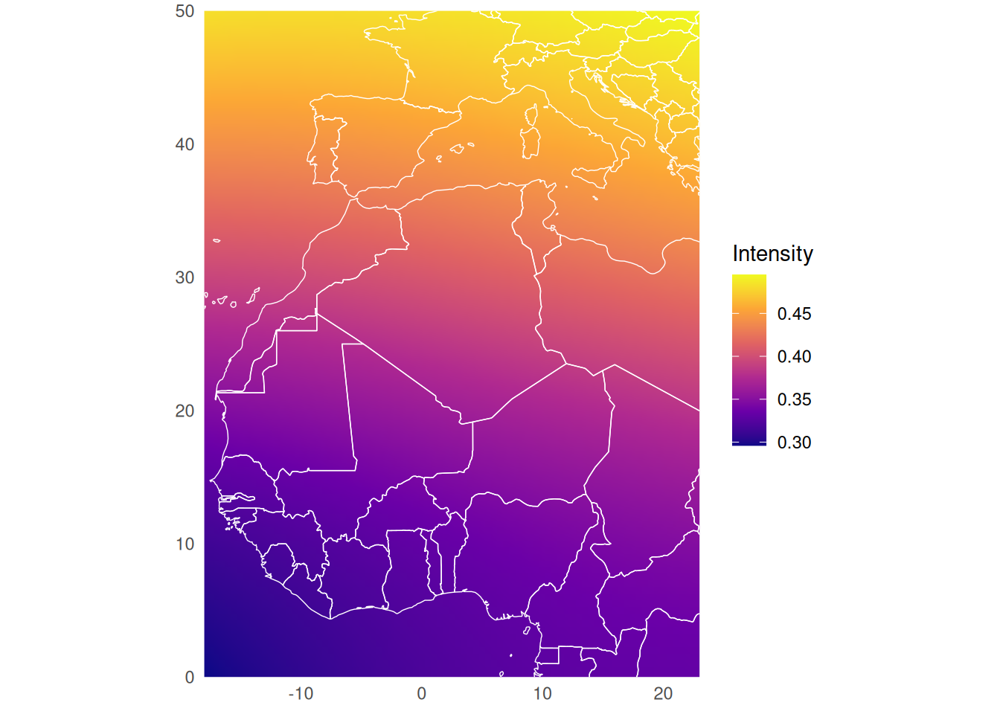

# Getting Started with GeoMagR

This vignette walks through the GeoMagR workflow on the bundled
Bee-eater tag `14DM`. We first inspect the raw sensor data, then
calibrate the magnetic measurements with
[`geomag_calib()`](https://geopressure.org/GeoMagR/reference/geomag_calib.html),
and finally build a magnetic likelihood map with
[`geomag_map()`](https://geopressure.org/GeoMagR/reference/geomag_map.html).

## 1. Load the sample tag

We start by loading the sample data bundled with the package. GeoMagR
builds on top of [GeoPressureR](https://geopressure.org/GeoPressureR/),
so we use the standard pipeline to create and label a GeoPressureR `tag`
object with
[`tag_create()`](https://geopressure.org/GeoPressureR/reference/tag_create.html)
and
[`tag_label()`](https://geopressure.org/GeoPressureR/reference/tag_label.html).

``` r
library(GeoMagR)
library(GeoPressureR)
library(maps)
library(withr)
library(ggplot2)

tag <- with_dir(system.file("extdata", package = "GeoMagR"), {
  tag_create("14DM", quiet = TRUE) |>
    tag_label(quiet = TRUE)
})
tag
```

[`tag_label()`](https://geopressure.org/GeoPressureR/reference/tag_label.html)
uses the labeled acceleration data to identify flight periods and create
stationary periods (`stap`).

We can check the orientation of the sensor:

``` r
tag$param$mag_axis
#> [1] "left"     "backward" "down"
```

The raw magnetic measurements are:

``` r
head(tag$magnetic) |> knitr::kable()
```

| date                | magnetic_x | magnetic_y | magnetic_z | acceleration_x | acceleration_y | acceleration_z | stap_id |
|:--------------------|-----------:|-----------:|-----------:|---------------:|---------------:|---------------:|--------:|
| 2015-07-15 00:00:00 |    0.30368 |    0.12848 |   -0.14048 |     -1.0158691 |      0.1159058 |      0.2175903 |       1 |
| 2015-07-15 04:00:00 |   -0.02016 |   -0.26800 |   -0.37840 |     -0.4349365 |     -0.0131836 |      1.9647217 |       1 |
| 2015-07-15 08:00:00 |   -0.19648 |    0.05904 |   -0.42176 |     -0.3776245 |     -0.1152954 |      1.1094971 |       1 |
| 2015-07-15 12:00:00 |    0.09968 |    0.16864 |   -0.33072 |     -0.9479370 |     -0.1127319 |      0.7674561 |       1 |
| 2015-07-15 16:00:00 |    0.28208 |   -0.12928 |   -0.22688 |     -0.9280396 |     -0.0083618 |      1.0251465 |       1 |
| 2015-07-15 20:00:00 |    0.26384 |   -0.12560 |   -0.26272 |     -1.0314331 |     -0.0047607 |      0.1928101 |       1 |

## 2. Inspect the raw acceleration

Confusingly, the SOI sensor stores
[`activity`](https://geopressure.org/GeoLocator-DP/core/measurements/#sensor)
and
[`mean_acceleration_z`](https://geopressure.org/GeoLocator-DP/core/measurements/#sensor)
as `tag$acceleration`, while the true 3-axis acceleration data is stored
in `tag$magnetic`. Typically, activity is sampled every 5-30 minutes,
while 3-axis acceleration-magnetic data is sampled at a coarser 4-6 hour
interval. In this vignette, and in GeoMagR in general, we use the 3-axis
acceleration.

We can visualize acceleration in a 3D scatter plot. We add a unit sphere
to show the value at rest (only gravity acts on the sensor). With our
left-backward-down reference frame, gravity should have a positive z
axis when the logger is perfectly horizontal, but the logger on the
bird’s back is typically slightly tilted backward (negative x axis).
Here, our bee-eater spends a significant part of its time with its back
fully vertical (x ~ -1 g, z ~ 0 g).

``` r
plot_mag(
  tag,
  type = "acceleration",
  static_thr_hard = 0.1,
  static_thr_outlier = 3
)
```

## 3. Inspect the raw magnetic field

The next plot shows the three magnetic axes in sensor coordinates.

Each color indicates a different stationary period, where the bird is
assumed to stay at the same location. Points with the same color lie on
the same radius of the sphere, indicating that the magnetic
intensity/magnitude is the same. As the bird moves south, the field
intensity decreases, resulting in the points moving closer to the
center. At the same time, near the equator, the magnetic field becomes
more horizontal, resulting in a point lying on a ring closer to the
center of the sphere.

``` r
plot_mag(tag, type = "magnetic")
```

We can see that the sphere is not exactly centered at `(0, 0, 0)`: our
next step is to correct that offset with magnetic calibration.

## 4. Calibrate the magnetic sensor

With
[`geomag_calib()`](https://geopressure.org/GeoMagR/reference/geomag_calib.html),
we compute the main magnetic quantities of interest: intensity `F`,
inclination `I`, and heading `H`. The function performs tilt
compensation and magnetic calibration, with additional pre- and
post-processing steps documented in the help page.

For `14DM`, we do not have laboratory calibration data, so we use
field-data calibration with `calib_method = "ellipse_stap"` because
stationary period information is available.

``` r
tag <- geomag_calib(
  tag,
  calib_data = FALSE, # use field-data calibration
  calib_method = "ellipse_stap",
  rm_outlier = TRUE
)
```

We can now plot the magnetic data again. This time the fitted
calibration ellipsoid is shown. By default, the smallest and largest
radii are displayed. The fitted parameters are stored in
`tag$param$geomag_calib`.

``` r
plot_mag(tag, type = "magnetic")
```

The `tag$magnetic` table is now enriched with several calibrated
variables. See the
[`geomag_calib()`](https://geopressure.org/GeoMagR/reference/geomag_calib.html)
documentation for the full list.

``` r
head(tag$magnetic) |> knitr::kable()
```

| date                | magnetic_x | magnetic_y | magnetic_z | acceleration_x | acceleration_y | acceleration_z | stap_id | is_static | magnetic_xc | magnetic_yc | magnetic_zc |     pitch |       roll | acceleration_xp | acceleration_yp | acceleration_zp | magnetic_xcp | magnetic_ycp | magnetic_zcp |         F |         I |          H |
|:--------------------|-----------:|-----------:|-----------:|---------------:|---------------:|---------------:|--------:|:----------|------------:|------------:|------------:|----------:|-----------:|----------------:|----------------:|----------------:|-------------:|-------------:|-------------:|----------:|----------:|-----------:|
| 2015-07-15 00:00:00 |    0.30368 |    0.12848 |   -0.14048 |     -1.0158691 |      0.1159058 |      0.2175903 |       1 | TRUE      |   0.4061788 |   0.1445833 |  -0.1335325 | 1.3327149 |  0.4894476 |               0 |               0 |        1.045356 |    0.0473190 |    0.1903869 |   -0.4064852 | 0.4513496 | 1.1211465 | 103.957551 |
| 2015-07-15 04:00:00 |   -0.02016 |   -0.26800 |   -0.37840 |     -0.4349365 |     -0.0131836 |      1.9647217 |       1 | FALSE     |   0.0940077 |  -0.2547237 |  -0.3770855 | 0.2178549 | -0.0067101 |               0 |               0 |        2.012331 |    0.0106553 |   -0.2572482 |   -0.3868138 | 0.4646666 | 0.9835227 | 267.628154 |
| 2015-07-15 08:00:00 |   -0.19648 |    0.05904 |   -0.42176 |     -0.3776245 |     -0.1152954 |      1.1094971 |       1 | FALSE     |  -0.0758625 |   0.0757948 |  -0.4235142 | 0.3264234 | -0.1035452 |               0 |               0 |        1.177657 |   -0.2094443 |    0.0316143 |   -0.3820967 | 0.4368801 | 1.0646165 |   8.583649 |
| 2015-07-15 12:00:00 |    0.09968 |    0.16864 |   -0.33072 |     -0.9479370 |     -0.1127319 |      0.7674561 |       1 | FALSE     |   0.2094104 |   0.1860336 |  -0.3297876 | 0.8849994 | -0.1458474 |               0 |               0 |        1.224860 |   -0.1408241 |    0.1361302 |   -0.3858215 | 0.4326905 | 1.1010430 |  44.029030 |
| 2015-07-15 16:00:00 |    0.28208 |   -0.12928 |   -0.22688 |     -0.9280396 |     -0.0083618 |      1.0251465 |       1 | FALSE     |   0.3852492 |  -0.1153498 |  -0.2212726 | 0.7357053 | -0.0081565 |               0 |               0 |        1.382842 |    0.1377454 |   -0.1171508 |   -0.4218838 | 0.4590034 | 1.1658669 | 220.380746 |
| 2015-07-15 20:00:00 |    0.26384 |   -0.12560 |   -0.26272 |     -1.0314331 |     -0.0047607 |      0.1928101 |       1 | TRUE      |   0.3676186 |  -0.1114682 |  -0.2581883 | 1.3859400 | -0.0246863 |               0 |               0 |        1.049311 |   -0.1834373 |   -0.1178073 |   -0.4082915 | 0.4628496 | 1.0803562 | 327.290575 |

First, the calibrated magnetic data `tag$magnetic_*c`. The measurements
are now centered on the origin and lie on a regular sphere, with a
radius that still varies slightly by stationary period.

``` r
plot_mag(tag, type = "magnetic_c")
```

The reprojected corrected magnetic data `tag$magnetic_*cp` shows the
magnetic field in the horizontal plane of the Earth frame after tilt
compensation. The ellipsoid rings are now horizontal, correcting for the
bird position.

``` r
plot_mag(tag, type = "magnetic_cp")
```

Finally, we can also plot the magnetic values as a time series, showing
the raw data and the mean value per stationary period.

``` r
plot_mag(tag, type = "timeseries")
```

## 5. Compute the magnetic likelihood map

Once the tag has been calibrated and the map extent has been defined,
[`geomag_map()`](https://geopressure.org/GeoMagR/reference/geomag_map.html)
can compare the observed field against the World Magnetic Model.

First, we define the spatio-temporal parameters of the map with
[`tag_set_map()`](https://geopressure.org/GeoPressureR/reference/tag_set_map.html).

``` r
tag <- tag_set_map(
  tag,
  extent = c(-18, 23, 0, 50),
  scale = 2,
  known = data.frame(
    stap_id = c(1, -1),
    known_lon = 7.27,
    known_lat = 46.19
  )
)
```

This reference map is normally computed automatically inside
[`geomag_map()`](https://geopressure.org/GeoMagR/reference/geomag_map.html),
but we show it explicitly here for clarity.

``` r
ref_map = geomag_map_ref(tag)
```

``` r
ref_map_df <- terra::as.data.frame(ref_map$intensity, xy = TRUE)
names(ref_map_df)[3] <- "intensity"
world <- map_data("world")

ggplot(ref_map_df, aes(x = x, y = y, fill = intensity)) +
  geom_raster(interpolate = TRUE) +
  geom_path(
    data = world,
    aes(long, lat, group = group),
    color = "white",
    linewidth = 0.25,
    inherit.aes = FALSE
  ) +
  coord_quickmap(xlim = c(-18, 23), ylim = c(0, 50), expand = FALSE) +
  scale_fill_viridis_c(option = "C", name = "Intensity") +
  labs(x = NULL, y = NULL) +
  theme_minimal(base_size = 11) +
  theme(
    panel.grid = element_blank(),
    legend.position = "right"
  )
```



The likelihood computation requires four standard deviations that
control the expected measurement error and uncertainty.

``` r
tag <- geomag_map(
  tag,
  compute_known = FALSE,
  sd_e_f = 0.009,
  sd_e_i = 2.6,
  sd_m_f = 0.014,
  sd_m_i = 3.5,
  ref_map = ref_map
)
```

The result is a spatial likelihood surface for each stationary period.

``` r
plot(tag, "map_magnetic_intensity")
```

We can also add a water mask, here just as an example for inclination.

``` r
if (requireNamespace("rnaturalearth", quietly = TRUE)) {
  tag$map_magnetic_inclination <- map_add_mask_water(
    tag$map_magnetic_inclination
  )
}
plot(tag, "map_magnetic_inclination")
```

## 6. What this workflow gives you

At this point, the tag object contains calibrated magnetic data, a
magnetic likelihood map, and all the metadata needed to continue into a
GeoPressureR workflow.

The same pattern can be adapted to a real deployment by replacing the
bundled sample tag with your own `GeoPressureR` tag object and changing
the map extent to match the study region.
