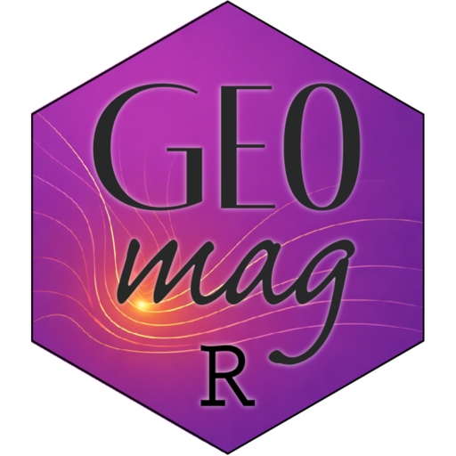

# GeoMagR



**GeoMagR** is an R package to estimate animal geolocation based on
triaxis magnetic field measurements, including:

- **Magnetic calibration:** Correct magnetic distortion using field-data
  or in-vitro data.
- **Likelihood map estimation:** Compute spatial likelihood maps using
  the World Magnetic Model (WMM), comparing observed and known intensity
  and inclination.
- **Interactive visualization:** Explore raw and calibrated data,
  ellipsoid fits, and 3D scatterplots.

GeoMagR is designed to work seamlessly with
[GeoPressureR](https://geopressure.org/GeoPressureR), enabling
high-resolution migratory track reconstruction using multi-sensor
archival tags.

------------------------------------------------------------------------

## 📦 Installation

To install the latest version from GitHub:

``` r
# install.packages("pak")
pak::pkg_install("GeoPressure/GeoMagR")
```

------------------------------------------------------------------------

## 📘 Vignettes

For full workflows, see the vignettes:

- [Getting Started with
  GeoMagR](https://geopressure.org/GeoMagR/articles/getting-started.html)
- [Movement Model with Magnetic
  Likelihoods](https://geopressure.org/GeoMagR/articles/movement-model-magnetic-likelihood.html)

------------------------------------------------------------------------

## 📚 Citation

If you use GeoMagR in your research, please cite:

> Nussbaumer, R. (2025). GeoMagR: Geolocation by Magnetic Field.
> <https://github.com/GeoPressure/GeoMagR>

For citation information in R:

``` r
citation("GeoMagR")
```
